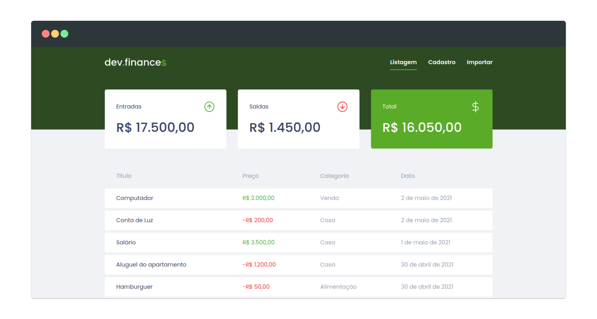
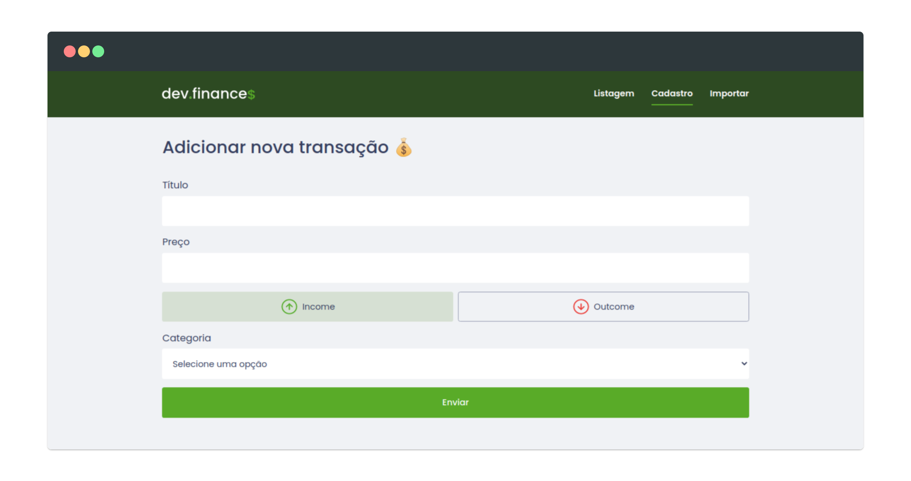
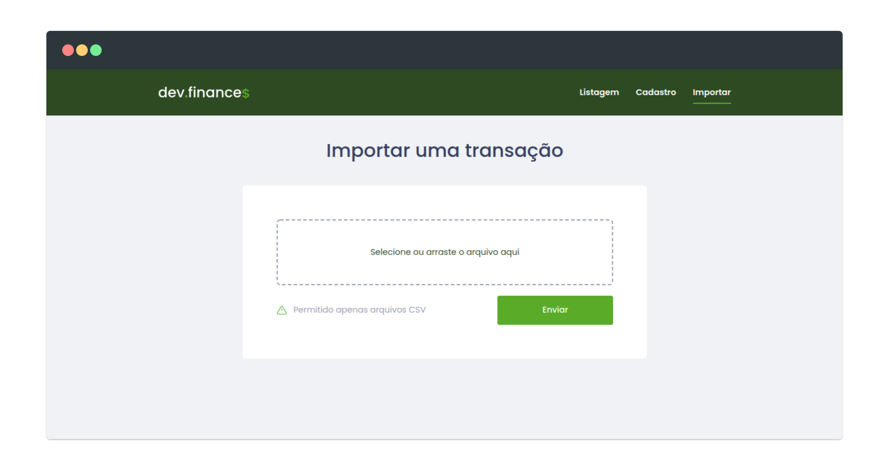

# dev.finance 💰

Ferramenta de balanço de gastos





## 🚀 Tecnologias

- [Next JS](https://nextjs.org/)
- [React](https://pt-br.reactjs.org/)
- [Context API](https://pt-br.reactjs.org/docs/context.html)
- [React Hook Form](https://react-hook-form.com/get-started)
- [Yup](https://github.com/jquense/yup)
- [React Dropzone](https://react-dropzone.js.org/)
- [Typescript](https://www.typescriptlang.org/)
- [Axios](https://github.com/axios/axios)
- [Sass](https://sass-lang.com/)
- [Node](https://nodejs.org/en/)
- [Express](https://expressjs.com/pt-br/)
- [TypeORM](https://typeorm.io/#/)
- [PostgreSQL](https://www.postgresql.org/)
- [Multer](https://github.com/expressjs/multer#readme)
- [csvtojson](https://github.com/Keyang/node-csvtojson)

## ✨ Features

- 📂 Compartilhamento de dados globais utilizando a [Context API](https://pt-br.reactjs.org/docs/context.html)
- 💅 Layout responsivo utilizando [Flexbox](https://docs.expo.io/versions/latest/sdk/async-storage/)
- 📋 Validação de formulários com [React Hook Form](https://react-hook-form.com/get-started)

## 🔥 Instalação

```bash
# frontend
$ yarn install
$ yarn dev

# backend
$ yarn install
$ yarn typeorm migration:run
$ yarn dev
```

> 💡 O código foi implementado todo do zero por mim, mas o layout é feito pela equipe da [Rocketseat](https://rocketseat.com.br/)

> 🚧 a aplicação mobile do sistema está em construção.
